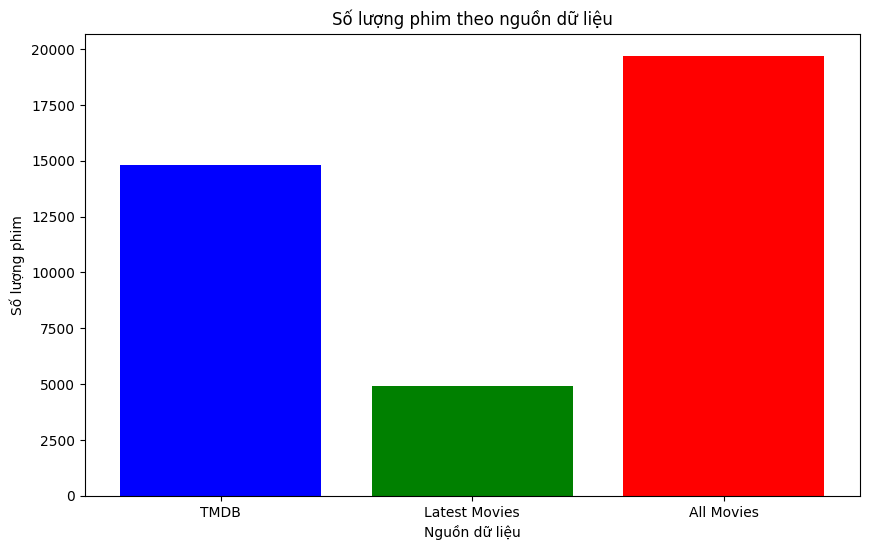
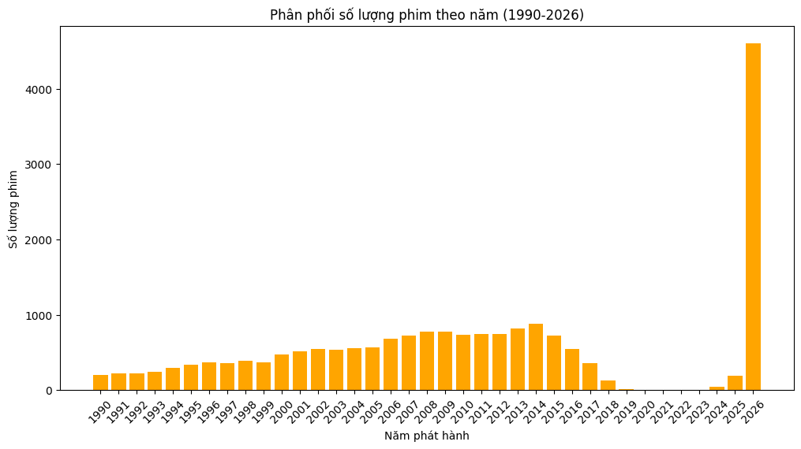

# Thông tin data

## 1. Nguồn data

### 1.1 MovieLens:

- Lấy từ: kagglehub.dataset_download("grouplens/movielens-latest-full")
  Số phim: 58098
  Số người dùng: 283228
  Số lượt đánh giá: 27753444

- Lọc phim: _MIN_RATINGS = 10_, _MIN_SCORE = 2.0_

- Lấy những phim từ 1990 trở về sau

- Tổng còn lại: 15,000 phim

### 1.2 TMDB:

- Lấy từ API TMDB, những phim mới nhất khoảng 5,000 phim

- Chưa có thông tin rating

## 2. Tổng số phim:

- Có khoảng 19,700 phim đã bỏ trùng theo _tmdb_id_

## 3. Khám phá dữ liệu

- Số phim theo nguồn
  

- Số phim theo năm
  

- Số phim theo năm từ 1990 đến 2026
  
