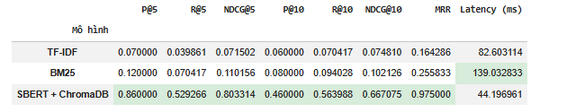
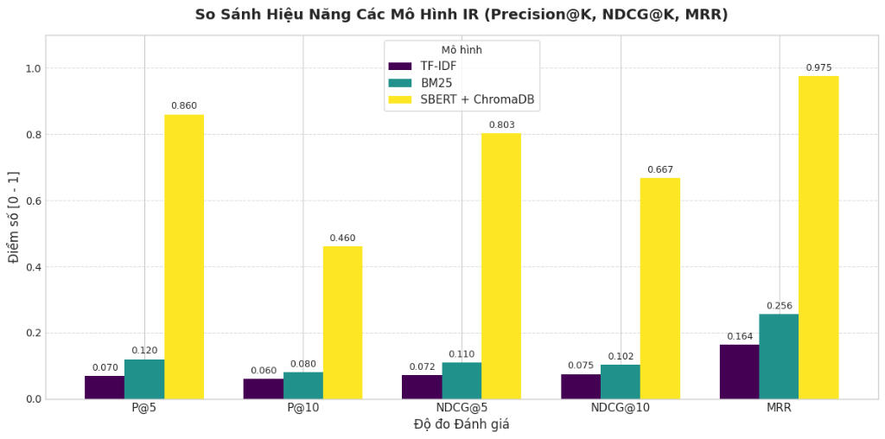
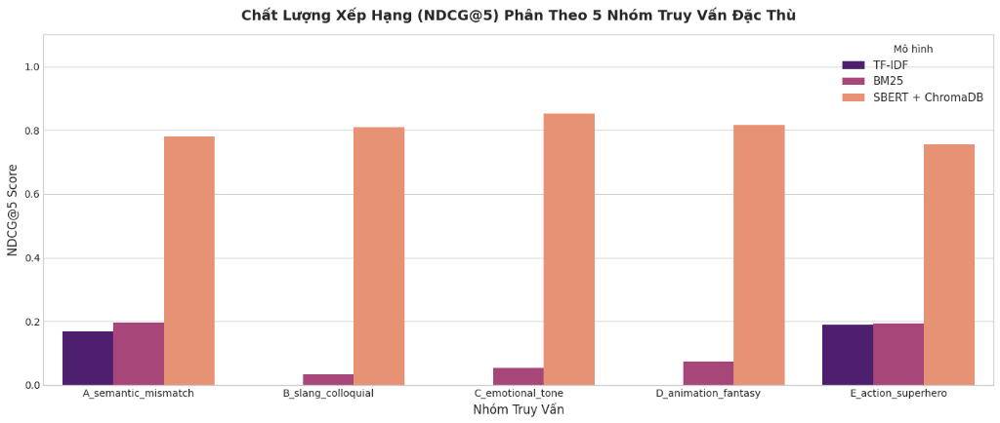
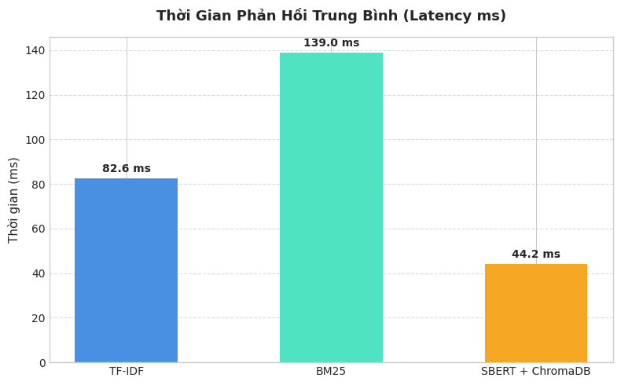

# EXPERIMENT TRACKING – NHẬT KÝ THỰC NGHIỆM

**Đề tài:** Ứng dụng mô hình ngôn ngữ vào hệ thống khuyến nghị phim  
**GVHD:** TS. Trần Trung Tín  
**Sinh viên:** Phan Nguyễn Quốc Thắng (52300063) — Trần Minh Thuyên (52300070)  
**Cập nhật:** 09/10/2026

---

## 1. Nhật ký các phiên chạy

| Run     | Ngày          | Dữ liệu                           | Mô hình / Cấu hình                                                    | Kết quả chính                            | Trạng thái         |
| ------- | ------------- | --------------------------------- | --------------------------------------------------------------------- | ---------------------------------------- | ------------------ |
| **#01** | 14/09         | 19.673 phim                       | TF-IDF (10k features), BM25 (Underthesea)                             | Đo tốc độ ban đầu, chưa có ground truth  | Hoàn thành         |
| **#02** | 25/09         | 14.815 phim, 10 queries           | SBERT MiniLM-L12-v2 + ChromaDB                                        | NDCG@5 ≈ 0,74; latency ≈ 25 ms           | Hoàn thành         |
| **#03** | 08/10         | 14.815 phim, 20 queries, 163 nhãn | TF-IDF (25k), BM25 (k1=1.5, b=0.75), SBERT 384d + HNSW                | SBERT NDCG@5 = 0,8033; latency = 44,2 ms | Hoàn thành (sơ bộ) |
| **#04** | Dự kiến 15/10 | 100 queries                       | Mở rộng ground truth, rà soát tính lập, kiểm chứng baseline và metric | Đánh giá độ tin cậy thống kê             | Kế hoạch           |
| **#05** | Chưa xác định | Ground truth đã kiểm chứng        | Hybrid Retrieval, Metadata Filtering, Redis Cache                     | Tối ưu chất lượng và tốc độ              | Kế hoạch           |

---

## 2. Cấu hình thực nghiệm Run #03

**Dữ liệu:**

- Corpus: 14.815 phim (TMDB + MovieLens), tóm tắt song ngữ Anh – Việt.
- Ground Truth: 20 queries, 163 lượt gán nhãn, 134 phim duy nhất.
- 5 nhóm truy vấn: Semantic Mismatch, Slang, Emotional Tone, Animation/Fantasy, Action/Superhero.

**Mô hình:**

- **TF-IDF:** 25.000 features, unigram + bigram, sublinear TF.
- **BM25:** Okapi BM25, k1 = 1.5, b = 0.75.
- **SBERT:** `paraphrase-multilingual-MiniLM-L12-v2`, embedding 384 chiều.
- **ChromaDB:** HNSW, cosine similarity; cấu hình dự kiến M=16, ef=100 (cần xác minh từ chỉ mục thực tế).

**Độ đo:** Precision@K, Recall@K, NDCG@K, MRR và Latency.

---

## 3. Kết quả định lượng Run #03

| Mô hình              |        P@5 |        R@5 |     NDCG@5 |       P@10 |       R@10 |    NDCG@10 |        MRR |      Latency |
| -------------------- | ---------: | ---------: | ---------: | ---------: | ---------: | ---------: | ---------: | -----------: |
| TF-IDF               |     0.0700 |     0.0399 |     0.0715 |     0.0600 |     0.0704 |     0.0748 |     0.1643 |     82.60 ms |
| BM25                 |     0.1200 |     0.0704 |     0.1102 |     0.0800 |     0.0940 |     0.1021 |     0.2558 |    139.03 ms |
| **SBERT + ChromaDB** | **0.8600** | **0.5293** | **0.8033** | **0.4600** | **0.5640** | **0.6671** | **0.9750** | **44.20 ms** |

**Nhận xét:**

- SBERT có NDCG@5 cao hơn TF-IDF khoảng 1.023,5% và BM25 khoảng 629,0%.
- SBERT đạt chất lượng truy xuất tốt nhất trên 20 truy vấn thử nghiệm.
- Kết quả latency chỉ mang tính tham khảo khi chưa chuẩn hóa môi trường đo.

**Giới hạn:** Ground truth còn nhỏ, chưa xác minh đầy đủ tính độc lập của nhãn và độ bao phủ phim liên quan. Kết quả hiện tại mang tính sơ bộ, chưa đủ để kết luận mô hình vượt trội trên mọi loại truy vấn.

---

## 4. Minh chứng thực nghiệm

**Bảng kết quả IR:**

**Biểu đồ so sánh mô hình:**

**NDCG@5 theo nhóm truy vấn:**

**So sánh thời gian phản hồi:**

**Case Study trên Colab:**

---

## 5. Kế hoạch thực nghiệm tiếp theo

### Run #04 – Benchmark Validation

1. Tăng ground truth từ 20 lên 100 queries, bổ sung các nhóm truy vấn đa dạng.
2. Candidate Pooling từ TF-IDF, BM25 và SBERT; gán nhãn độc lập, bổ sung phim không liên quan.
3. Chuẩn hóa relevance 0–3, sử dụng ngưỡng ≥2 cho metric nhị phân.
4. Mời người đánh giá thứ hai, tính Cohen's Kappa.
5. Cải thiện baseline với tokenizer tiếng Việt.
6. Chạy lại benchmark, bổ sung NDCG@20, confidence interval 95% và phân tích lỗi.

### Run #05 – System Optimization

1. Thử nghiệm Hybrid Retrieval (BM25 + SBERT bằng RRF).
2. Tích hợp Redis Semantic Cache, đo cache hit rate và latency P50/P95.

---

## 6. Quy định ghi log

Mỗi phiên chạy cần lưu:

- Run ID, ngày chạy, Git commit và phiên bản dữ liệu.
- Cấu hình mô hình, random seed và môi trường CPU/GPU.
- Ground truth version, quy tắc relevance và metric.
- Kết quả CSV/JSON, biểu đồ và nhận xét.

**Nguyên tắc:** Không ghi đè kết quả cũ; khi thay đổi dữ liệu, cấu hình hoặc phương pháp đánh giá phải tạo Run mới.

---

## 7. Kết luận

Run #03 cho thấy **Sentence-BERT + ChromaDB có tiềm năng cải thiện đáng kể chất lượng tìm kiếm phim bằng ngôn ngữ tự nhiên**, đạt NDCG@5 = 0,8033 và MRR = 0,9750 trên tập thử nghiệm hiện tại.

**Ưu tiên tiếp theo:** Hoàn thiện ground truth và kiểm chứng kết quả trong Run #04, sau đó tối ưu chất lượng và hiệu năng hệ thống ở Run #05.

_Cập nhật: 09/10/2026 — Phiên hoàn thành gần nhất: Run #03._
