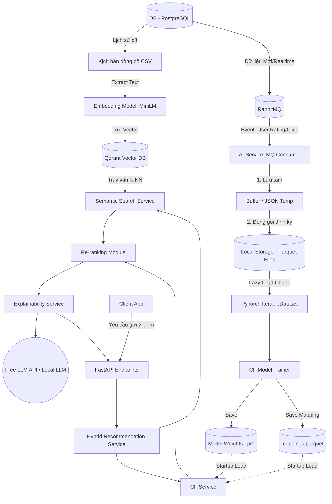

# Kế hoạch Thiết kế Kiến trúc AI-Service (V7 - Hoàn chỉnh)

Tài liệu này phác thảo chi tiết luồng dữ liệu (Data Flow) từ Backend truyền sang, cách quản lý lưu trữ, quy trình huấn luyện mô hình, và cách các dịch vụ AI kết hợp Lọc cộng tác (CF), Semantic Search, và Giải thích AI (Explainable AI).

---

## 1. Sơ đồ Kiến trúc Hệ thống Tổng thể

---

## 2. Chi tiết Luồng Vận hành (Data Flow & Pipeline)

### 2.1. Đẩy Dữ Liệu và Lưu Trữ (Data Ingestion & Storage)
- **Từ Backend qua AI-Service:** Mỗi khi User có hành động (đánh giá phim, click xem phim) trên Backend NestJS, một event JSON sẽ được bắn vào **RabbitMQ**.
- **AI-Service Nhận Data:** Consumer của AI-Service sẽ nghe Queue này. Thay vì chọc thẳng vào Database, nó lưu tạm dữ liệu vào Memory Buffer.
- **Chuyển hóa Storage:** Cứ mỗi 1000 events (hoặc sau mỗi 1 giờ), AI-Service sẽ đóng gói đống JSON này thành một file **Parquet** nén. Các file Parquet này lưu thẳng trên ổ cứng của server AI-Service (Local Storage / Data Lake). Điều này giúp tối ưu không gian đĩa và tốc độ đọc, vì Parquet nén cực kỳ nhỏ gọn.

### 2.2. Khởi Động Huấn Luyện (Model Training)
- **Train Định kỳ (Cronjob):** Một kịch bản chạy ngầm (ví dụ mỗi nửa đêm) sẽ kích hoạt class `ModelTrainer`.
- **Cách nạp Data:** Không nạp toàn bộ vào RAM. PyTorch sử dụng `IterableDataset` để lướt qua từng khối Parquet (Batch by Batch).
- **Lưu Model:** Huấn luyện xong, trọng số (weights) của Model được lưu thành file nhị phân `cf_model.pth` trong thư mục `artifacts/models/`. Đồng thời, từ điển Mapping (`UUID` của User/Movie sang `Integer Index`) được lưu thành file `mappings.parquet` bên cạnh file model.

---

## 3. Lớp Dịch vụ Xử Lý (Service Layer & Inference)

### 3.1. Nạp Mô hình (Model Initialization)
Làm sao để service có model dự đoán?
- **Load 1 lần duy nhất (Singleton Pattern):** Khi FastAPI khởi động (`startup event`), nó sẽ đọc file `cf_model.pth` và `mappings.parquet` nạp thẳng lên RAM (hoặc VRAM của GPU nếu có).
- Bất cứ Yêu cầu (Request) nào gọi tới API cũng sẽ dùng chung Instance Model này trên RAM, đảm bảo tốc độ phản hồi tính bằng mili-giây (Tức là không phải mỗi Request lại đọc file trên ổ cứng một lần).

### 3.2. Semantic Search với Vector Database
- Sử dụng **Qdrant** (hoặc ChromaDB tùy cấu hình, nhưng Qdrant tối ưu hiệu năng tốt hơn cho Production) làm Vector DB.
- Thông tin phim (Mô tả nội dung, đạo diễn, thể loại) được chuyển hóa thành Vector bằng một mô hình ngôn ngữ nhỏ gọn như `all-MiniLM-L6-v2`.
- Khi gợi ý bằng Semantic, hệ thống sẽ truy xuất các Vector gần giống nhất với lịch sử phim mà User đã thích thông qua **Qdrant**.

### 3.3. Dịch vụ Hybrid & Re-ranking
Làm sao kết hợp CF và Semantic?
1. **Lấy danh sách ứng viên (Candidate Generation):**
   - CF Service lấy ra Top 50 phim dựa trên thuật toán Ma trận người dùng.
   - Semantic Service lấy ra Top 50 phim dựa trên nội dung tương đồng (Vector Search).
2. **Xếp hạng lại (Re-ranking):** Gộp 2 mảng ứng viên lại. Tính điểm tổng kết:
   - `Điểm CF` được chuẩn hóa (Normalize) về thang 0-1.
   - `Điểm Semantic` được chuẩn hóa về thang 0-1.
   - `Final_Score = (Weight_CF * CF) + (Weight_Semantic * Semantic)`.
   - Cắt lấy Top 10 phim có điểm `Final_Score` cao nhất.

### 3.4. Dịch vụ Giải Thích (Explainable AI - XAI)
Làm sao để giải thích tường minh dựa trên bằng chứng?
- Sau khi có Top 10 phim ở bước Hybrid, ta thu thập "Bằng chứng" (Evidence):
  - *Ví dụ Evidence 1:* Phim A được gợi ý vì Điểm Semantic cực cao (Có cùng diễn viên và đạo diễn với phim User vừa xem).
  - *Ví dụ Evidence 2:* Phim B được gợi ý vì Điểm CF rất cao (Cộng đồng những User giống bạn đang đổ xô đi xem phim này).
- **Prompting:** Tạo một đoạn text (Prompt) kết hợp Thông tin User + Thông tin Phim + Evidence.
- **Sử dụng Mô hình LLM:**
  - **Mặc định:** Gọi API của các AI Model miễn phí (như Google Gemini Free Tier, hoặc OpenAI GPT-4o-mini).
  - **Tương lai:** Nếu Server đủ mạnh, triển khai chạy cục bộ các model Fine-Tuned như `Phi-3-mini` hoặc `Llama-3-8B-Instruct` để tự tạo lời giải thích siêu tốc và bảo mật 100% không tốn tiền API.
- **Kết quả trả về cho Frontend:** Một câu string ngôn ngữ tự nhiên: *"Chúng tôi nghĩ bạn sẽ thích 'Inception' vì nó có cốt truyện hack não tương tự 'Interstellar' mà bạn vừa đánh giá 5 sao tuần trước, hơn nữa những người giống bạn cũng cực kỳ yêu thích bộ phim này."*

## 4. Huấn luyện mô hình lọc cộng tác trên notebooks